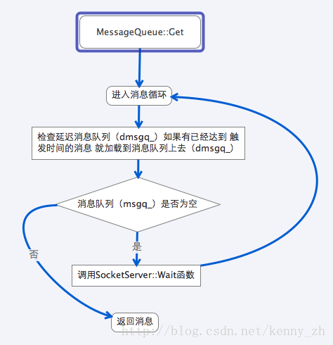
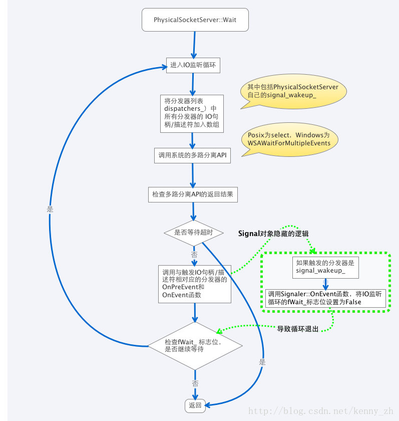
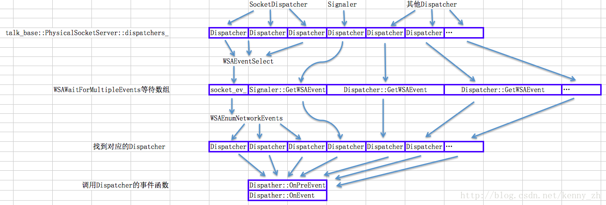
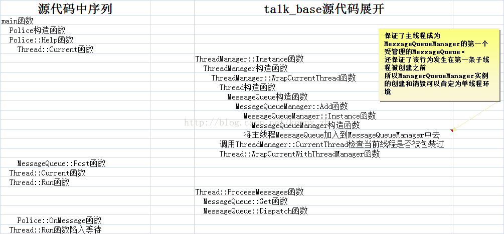
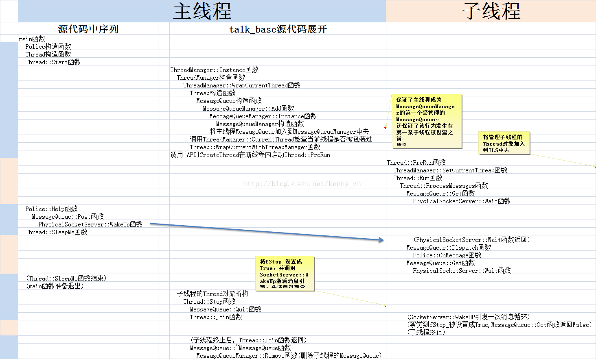

From https://blog.csdn.net/kenny_zh/category_2487849.html

## 前言
最近要找工作，发现某美国硅片巨头正在招聘WebRTC相关开发工程师，非常感兴趣。所以决定深入研究一下WebRTC的源代码。

 

其实，前一阵子就下载过WebRTC的源代码，发现非常适合我的“口味”。这是我第一次看到在Linux系统上实现类似Win32风格的多线程编程。过去看到的有关Linux的书籍、教程一般都是仅仅介绍一些Posix标准的多线程例程和同步工具，例如pthread、mutex、条件变量等。虽然理解这些东西对我来说并不是一个问题，但是对于一个用惯了WaitForMultipleObjects的Win32程序员来说，实在有些不习惯。因此，在看到WebRTC源代码时，我就被它深深地吸引住了。既然，这次某硅片巨头提供WebRTC相关的工作，那就好好深入研究一下WebRTC的源代码，希望能够在面试的时候能用得着。

 

当然，需要提一下的是，WebRTC的代码并非一定是教科书般的范例。相反为了满足适应各种Linux版本的需求，WebRTC选择了最具广泛适应性的Linux API来实现。比如在physicalsocketserver.h中PosixSignalHandler类的上面有一段注释：

 
``` cc
    // These two classes use the self-pipetrick to deliver POSIX signals to our
    // select loop. This is the only safe,reliable, cross-platform way to do
    // non-trivial things with a POSIX signalin an event-driven program (until
    // proper pselect() implementations becomeubiquitous).
```

可以反映出WebRTC开发人员为了平台通用性所作出的不得已的选择。因此，学习WebRTC的源代码更多地是学习它的设计思路，具体从事开发项目时如果可以确定目标平台，应该选择更为合适的API。如果项目同样涉及跨平台需求，那么参考WebRTC的源代码确实是不错的选择。

 

在具体分析WebRTC源代码之前，我想先介绍一下本文的定位。本文主要是作为我自己对WebRTC源代码的学习总结，并帮助一些和我类似的Win32开发人员顺利地掌握Linux开发思路。因此，本文的主要读者至少应具备良好的C++语法基础，并具有相关的Windows开发经验。在以后的篇章中，我不会对C++语法和Windows API有过多的展开。如果你是一个熟练地Linux开发人员，希望学习win32开发，那真的很抱歉，本文可能无法为你提供有用的帮助。

 

此外，还要说明一下的是，这篇文章的工作环境是MAC OSX。这是因为我同时也在学习IOS开发，OSX是唯一一个可以同时学习IOS和POSIX开发的环境。当然，这也给我后来尝试独立编译talk_base造成了一些麻烦。因为在OSX平台上，WebRTC有一些独特的编译配置。当然本文的读者可能需要自行修改我提供的一些make脚本才能将他们应用在Linux环境中。不便之处我也只能说抱歉了。

 

好了，废话不多说，让我们开始WebRTC源代码探索之旅吧！


## 多线程篇（1）

随着CPU频率接近物理极限，多芯片、多核几乎成为了加速软件运行速度的唯一选择。与之相应地，多线程、异步编程以及并发编程成为了软件开发人员的必修课。因此，各种各样的开发框架不断涌现。在C++领域，boost的thread库等优秀的多线程框架也是其中的代表。特别是针对socket网络编程的boost.asio库可以轻松帮助开发人员实现多线程大量并发的网络服软件。

 

与这些框架相比，WebRTC的多线程模型还是比较特别的。它的核心是类似于WSAWaitForMultipleEvents的多路信号分离器。这是我最喜欢的多线程模型。它使每条线程既可以处理消息（post、send），同时也可以处理多个IO。并且在必要的情况下让一条线程独占（管理）一些资源，避免过多的使用锁造成线程死锁。个人认为这种模型可以帮助开发人员更容易地实现快速响应的界面程序。

 

WebRTC的线程模块放在/trunk/talk/base目录下，namespace使用talk_base：：。主要涉及criticalsection、event、messagequeue、thread、messagehandler、physicalsocketserver等文件。顺便提一下，现在网上仅有的几篇关于WebRTC或是libjingle的文章多数从Sigslot开始讲解，但是我不打算现在对Sigslot进行展开，因为它还是很好理解的。不明白的朋友可以上网查询一下，或者姑且就把它当做函数回调（更精确地说它实现了C#的delegate）就可以了。在talk_base的多路信号分离器中只有少数几个地方使用了Sigslot，即使忽略它也不影响对多路信号分离器的理解。

 

1 event

 

event.h/event.cc文件中只有talk_base::Event类。

 

1.1 talk_base::Event

 

该类主要实现了跨平台的Win32 Event功能（正如前言中所说，本文假定读者已经很熟悉Win32平台的各种组件，如有不明白的地方可以参考MSDN）。talk_base::Event类的各个成员函数与Win32 Event所提供的API几乎一致，所以不再多做解释。

 

在Linux系统中，WebRTC使用了mutex和条件变量来实现Event的功能。首先，我将对Win 32 API和pthread API做一下类比：

 

CreateEvent

pthread_mutex_init、pthread_cond_init这两个函数用来创建pthread的mute和条件变量。

 

CloseHandle

pthread_mutex_destroy、pthread_cond_destroy这两个函数用来销毁pthread的mute和条件变量。

 

SetEvent

pthread_mutex_lock、pthread_mutex_unlock这两个函数加锁和解锁mutex，pthread_cond_broadcast函数用来解除所有等待在该条件变量上的线程的阻塞状态。

 

ResetEvent

pthrea_mutex_lock、pthread_mutex_unlock（已解释）

 

WaitForSingleObject

pthrea_mutex_lock、pthread_mutex_unlock（已解释）。pthrea_cond_wait函数用来使线程阻塞在条件变量上。

 

下面我将大致解释一下talk_base::Event类的实现原理：

 

talk_base::Event的主要功能由条件变量实现，mutex只是辅助条件变量起到锁的作用。条件变量的pthread_cond_wait和pthread_cond_broadcast函数与Win32 Event的WaitForSingleObject和SetEvent基本类似。talk_base::Event是否为signal状态由布尔类型的成员变量event_status_控制。是否为manual reset的Event由布尔类型的成员变量is_manual_reset_控制。与Win32 Event不同的状况主要体现在Event的manual reset控制上。

 

Linux系统下所有调用talk_base::Event::Wait函数的线程会阻塞在pthread_cond_wait函数上。当talk_base::Event::Set函数被调用时，pthread_cond_broadcast函数会解除所有等待在pthread_cond_wait函数上的线程的阻塞状态。这对于manual reset的Win32 Event来说没什么问题，问题出在auto reset的Win32 Event上。Auto reset的Win32 Event每次只能解除一条等待在Event上的线程的阻塞状态，其他线程依然为阻塞状态。这就需要mutex来配合实现了。

 

在这里要重点解释一下pthread_cond_wait函数的第二个参数pthread_mutex_t *mutex。当线程进入pthread_cond_wait函数时会解锁mutex，而在离开pthread_cond_wait时会重新加锁mutex。可以理解为：

 
``` cc
    int pthread_cond_wait(pthread_cond_t *cond,pthread_mutex_t *mutex)
    {
      pthread_mutex_unlock(mutex);
      …
      …
      …
      pthread_mutex_lock(mutex);
      return 0;
    }
```

这是Win32 没有的行为，需要特别注意。

 

有了以上的机制后，模拟auto rest的Win32 Event就没问题了。当第一条线程获得mutex锁并离开pthread_cond_wait函数时，其他线程会依然被阻塞在pthread_mutex_lock(mutex)函数上，无法离开pthread_cond_wait函数。那条成功离开线程会马上检测当前的talk_base::Event是否为manual reset的，如果不是就马上将event_status_成员变量设置为false，并解锁mutex。这时其他线程才能有机会离开pthread_cond_wait函数。不过当他们离开pthread_cond_wait后立即检测event_status_成员变量，如果为false就重新调用pthread_cond_wait函数。这就完美实现了Win32 Event的auto reset的语义。

 

条件变量和mutex的配合是talk_base::Event类的难点。如果读者还是不能完全理解，请仔细阅读以上3段的内容（也可以上网查找pthread_cond_wait函数），并结合event.cc的源代码反复揣摩，应该可以很快理解的（毕竟代码不多，而且也不是WebRTC中真正困难的部分），我就不再多做解释了（在后面的部分我会提供独立编译\trunk\talk\base\目录下的源代码的makefile脚本，读者可以编译后添加调试代码分析talk_base::Event的原理）。

 

在分析了talk_base::Event的源代码之后有个疑问，那就是为什么不用pthread_cond_signal函数实现Win32 Event的auto reset语义？由于时间的原因暂且不做深入地研究。

## 多线程篇（2）

2 crticalsection

 

criticalsection.h/criticalsection.cc文件中包含了3个类talk_base::CriticalSection、talk_base::CritScope和talk_base::TryCritScope。这3个类对于有多线程编程经验的Windows开发人员来说都是非常容易理解的。基本上就是对Win32 CriticalSection的简单封装。

 

2.1 talk_base::CriticalSection

 

talk_base::CriticalSection主要实现了跨平台实现临界区的功能。在Linux平台上使用了pthread的mutex模拟Win32的Critical Section。以下对比一下API：

 

InitializeCriticalSection

 

pthread的mutex初始化略比Win32的CriticalSection复杂一些。pthread_mutexattr_init函数用来初始化一个mutex属性变量。pthread_mutexattr_settype函数用来设置mutex的各种属性。在talk_base::CriticalSection中为mutex设置了PTHREAD_MUTEX_RECURSIVE。通过网上查询该属性被描述为：

 

“如果一个线程对这种类型的互斥锁重复上锁，不会引起死锁，一个线程对这类互斥锁的多次重复上锁必须由这个线程来重复相同数量的解锁，这样才能解开这个互斥锁，别的线程才能得到这个互斥锁。如果试图解锁一个由别的线程锁定的互斥锁将会返回一个错误代码。如果一个线程试图解锁已经被解锁的互斥锁也将会返回一个错误代码。这种类型的互斥锁只能是进程私有的（作用域属性为PTHREAD_PROCESS_PRIVATE）。”

 

通过设置不同的属性pthread mutex可以实现很多不同的特性。如果读者有兴趣可以上网查询一下不同的属性的意义。不过需要注意到的是在talk_base::Event类中没有mutex属性，直接使用默认值创建了mutex。接着使用talk_base::CriticalSection使用pthread_mutex_init函数创建了mutex。最后请不要忘记调用pthread_mutexattr_destroy将mutex属性变量销毁掉。

 

DeleteCriticalSection

 

pthread_mutex_destroy函数用以销毁mutex。

 

EnterCriticalSection

 

pthread_mutex_lock函数用以对mutex加锁。

 

TryEnterCriticalSection


pthread_mutex_trylock函数用以尝试对mutex加锁，如果加锁成功就返回true，失败就返回false。

 

LeaveCriticalSection

 

pthread_mutex_unlock函数用以解锁mutex.

 

在talk_base::CriticalSection中有个调试宏CS_TRACK_OWNER。如果使用了这个宏，talk_base::CriticalSection可以使用CurrentThreadIsOwner函数用来判断是否是在当前线程加锁。在的段落重点提到过talk_base::CriticalSection使用PTHREAD_MUTEX_RECURSIVE属性来创建mutex，该属性导致在另一个线程线程(非加锁线程)解锁mutex会返回一个错误。

 

2.2 talk_base::CritScope


利用构造函数加锁talk_base::CriticalSection；并利用析构函数在退出代码块的时候解锁talk_base::CriticalSection。该手法对于所有C++开发人员并不陌生。

  

2.3 talk_base::TryCritScope

 

类似于talk_base::CritScope，利用构造函数尝试加锁talk_base::CriticalSection；并利用析构函数在退出代码块的时候解锁talk_base::CriticalSection。

 

对于大多数熟练的Win32开发人员来说前两个文件的内容是很好理解的，不过是2道开胃菜而已。接着我们要真正开始进入分析多路信号分离器的范围了。这也是多线程篇的重点部分。我会尽可能详细的分析整个多路信号分离器的工作原理。不过也会抛弃一些实现细节，比如所有的代码分析都是基于“永久”等待信号事件的流程，不会去分析如何计算下一次等待时间。这样可以让我们更加专注于多路信号分离器的原理，而不被一些细节困扰。

## 多线程篇（3）

3 messagehandler

 

messagehandler.h/messagehandler.cc文件仅仅定义了talk_base::MessageHandler类，和一个模板工具类talk_base::FunctorMessageHandler类。

 

3.1 talk_base::MessageHandler

 

talk_base::MessageHandler类的主要功能是定义了消息处理器的基本数据结构，子类在继承了该类之后要重载OnMessage函数，并实现消息响应的逻辑。

 

3.2 talk_base::FunctorMessageHandler

 
talk_base::FunctorMessageHandler类的主要功能是将一个函数投递到目标线程执行。该类主要通过functor模板实现（熟悉C++的读者应该不会对它陌生，不熟悉的可以上网查找），而且定义了一个针对返回值类型为void的函数的特化版本（模板的特化和偏特也应该是一个C++程序员掌握的一个知识点，该语法有些难度）。用户不需要创建或者继承talk_base::FunctorMessageHandler类，仅需调用talk_base::Thread::Invoke函数就能使用它的功能。 

## 多线程篇（4 - 1）

4 messagequeue

 

messagequeue.h/messagequeue.cc文件是多路信号分离器的重要组成部分。它实现了消息一个完整地消息队列，该队列包括立即执行消息队列、延迟执行消息队列和具有优先级的消息队列。其中，talk_base::MessageQueue类也是talk_base::Thread类的基类。所以，所有的WebRTC的线程都是支持消息队列的。

 

4.1 talk_base::MessageQueueManager

 

talk_base::MessageQueueManager类是一个全局单例类。这个类看似比较复杂，但是功能其实非常简单——仅仅为了在所有的talk_base::MessagerQueue中删除与指定的talk_base::MessageHandler相关的消息。WebRTC的消息队列在发送消息的时候要指定消息处理器（talk_base::MessageHandler）。如果某个消息处理器被析构，那么与之相关的所有消息都将无法处理。所以，创建了这个全局单例类来解决这个问题（见talk_base::MessageHandler析构函数）。

 

talk_base::MessageQueueManager的代码没有涉及任何跨平台的API调用，而且本身功能也非常简单。所以我就不讨论它如何使用std::vector管理talk_base::MessageQueue。唯一需要注意的就是talk_base::MessageQueueManager如何保证自己在第一个talk_base::Thread类实例化之前完成talk_base::MessageQueueManager全局单例的实例化。这当中有个有趣的状况，talk_base::MessageQueueManager在保证了自己必然在第一条子线程被创建之前自己被实例化，talk_base::MessageQueueManager:: Instance函数内部没有使用任何锁来保护talk_base::MessageQueueManager::instance_实例的创建。

 

如前面所说，talk_base::MessagerQueue是talk_base::Thread的基类。在创建talk_base::Thread时必然会调用talk_base::MessagerQueue的构造函数。在talk_base::MessagerQueue的构造函数中调用了talk_base::MessageQueueManager::Add函数，而该函数会使用talk_base::MessageQueueManager::Instance函数创建talk_base::MessagerQueueManager的实例。由于talk_base::ThreadManager保证了在创建第一个子线程之前，主线程会被包装成talk_base::Thread对象，所以talk_base::MessageQueueManager必然可以将主线程作为第一个talk_base::MessageQueue对象纳入管理。

 

以上的描述可能比较晦涩难懂，这是因为整个流程涉及到了talk_base::Thread和talk_base::ThreadManager等类。而这些都是尚未讲解过他们的代码。不过即使看不明白也没关系，我会在讲解完所有相关类之后演示2段范例代码，并将范例代码的调用栈完全展开。看过范例代码后绝大多数读者都应该能够明白talk_base::MessageQueueManager的原理。

 

talk_base::MessageQueueManager还有最后一个问题，那就是它什么时候被析构。talk_base::MessageQueue的析构函数会调用talk_base::MessageQueueManager::Remove函数，并且“理论上来说”在最后一个talk_base::MessageQueue从队列中移除之后会析构talk_base::MessageQueueManager。既然，所有的线程都被移除，那就意味着talk_base::MessageQueueManager实例在被delete时重新回到了单线程的环境，所以也没有任何锁的保护。

 

4.2 MessageData

 

这一节的内容将包括talk_base::MessageData类以及多个它的子类和几个工具函数。这些类和函数都很简单，所以就不介绍代码和原理，仅仅罗列一下它们的功能。

 

4.2.1 talk_base::MessageData

 

定义了基类，并将析构函数定义为虚函数。

 

4.2.2 talk_base::TypedMessageData

 

使用模板定义的talk_base::MessageData的一个子类，便于扩展。

 

4.2.3 talk_base::ScopedMessageData

 

类似于talk_base::TypedMessageData，用于指针类型。在析构函数中，自动对该指针调用delete。

 

4.2.4 talk_base::ScopedRefMessageData

 

类似于talk_base::TypedMessageData，用于引用计数的指针类型。

 

4.2.5 talk_base::WrapMessageData函数

 

模板函数，便于创建talk_base::TypedMessageData

 

4.2.6 talk_base::UseMessageData函数

 

模板函数，用于将talk_base::TypedMessageData中的Data取出

 

4.2.7 talk_base::DisposeData

 

这是一个很特殊的消息，用以将某个对象交给消息引擎销毁。可能的用途有2个：1. 有些函数不便在当前函数范围内销毁对象，见范例talk_base::HttpServer::Connection::~Connection；2.某对象属于某一线程，因此销毁操作应该交给所有者线程（未见范例）。WebRTC用户不需要自行使用该类，调用talk_base::MessageQueue::Dispose函数即可使用它的功能。

 

以上7个类或函数的实现非常简单，有C++使用经验的读者非常容易就能理解（标准库中就有相似的类）。


4.3 Message

 

这一节将简单介绍一下3个类：talk_base::Message、talk_base::DelayedMessage和talk_base::MessageList。

 

4.3.1 talk_base::Message

 

定义了消息的基本数据结构。

 

4.3.2 talk_base::DelayedMessage

 

定义了延迟触发消息的数据结构。在talk_base::MessageQueue中，延迟消息被存放在以talk_base::DelayedMessage::msTrigger_排序（talk_base::DelayedMessage类定义了operator<）的队列中。如果2个延迟消息的触发时间相同，响应顺序按先进先出原则。

 

这里我将简单介绍一下各个成员变量的用途：

cmsDelay_：延迟多久触发消息，仅作调试使用

msTrigger_：触发消息的时间

num_：添加消息的时间

msg_：消息本身

 

在使用延迟消息时，不需要自行构建talk_base::DelayedMessage实例。直接调用talk_base::MessageQueue::PostDelayed或者talk_base::MessageQueue::PostAt函数即可。

 

4.3.3 talk_base::MessageList

 
消息列表，定义为std::list<talk_base::Message> 


## 多线程篇（4 - 2）

4.4 talk_base::MessageQueue

 

现在我们正式进入多线程篇最为激动人心的部分——多路信号分离器的消息队列组件。WebRTC的多路型号分离器由2部分组成：消息队列和talk_base::SocketServer（主要实现就是talk_base::PhysicalSocketServer）。消息队列负责接受消息，并使用消息处理器（talk_base::MessageHandler的子类）处理消息。在处理完所有消息后，消息队列调用talk_base::SocketServer::Wait函数阻塞等待新的IO信号。如果有新的消息进入，消息队列会调用talk_base::SocketServer::WakeUp唤醒talk_base::SocketServer阻塞等待。这就是消息队列和talk_base::SocketServer协同工作的基本流程。

 

让我们先来看一下，消息队列的实现。消息队列的主要功能是接收和处理消息，并作为talk_base::Thread的基类出现。

 

它的主要部件（成员变量）包括：

ss_：协同工作的talk_base::SocketServer

default_ss_：默认的talk_base::SocketServer。如果在构造的时候提供talb_base::SocketServer，那么消息队列就使用用户提供的；如果没有提供，消息队列就初始化一个talk_base::PhysicalSocketServer并保存在default_ss_上，然后赋值给ss_。在消息队列析构的时候，如果default_ss_保存有默认构造talk_base::PhysicalSocketServer，那就销毁它

msgq_：消息队列，队列内的消息按照先进先出的原则立即执行

dmsgq_：延迟消息队列，队列内的消息按照指定的时间延迟执行

 

接着，我们来看一下talk_base::MessageQueue的主要成员函数：

talk_base::MessageQueue::Get：等待接收消息。

参数说明：

pmsg：存放消息的指针，用于返回消息

cmsWait：等待的时间，kForever表示无限等待

process_io：是否要求talk_base::SocketServer处理IO信号

 

talk_base::MessageQueue::PostDelayed：发送一个延迟消息（从当前时间计算延迟处理时间）

参数说明：

cmsDelay：延迟毫秒数

phandler：消息处理器（talk_base::MessageHandler的子类）

id：消息ID

pdata：MessageData指针

 

talk_base::MessageQueue::PostAt：发送一个延迟消息（直接指定延迟处理时间）

参数说明：

tstamp：消息触发的时间

phandler：消息处理器（talk_base::MessageHandler的子类）

id：消息ID

pdata：MessageData指针

 

talk_base::MessageQueue::Clear：通过指定talk_base::MessageHandler和消息ID删除消息

参数说明：

phandler：指定被删除消息的talk_base::MessageHandler

id：指定被删除消息的ID；如果该id为MQID_ANY所有与phandler相关的消息都将被删除

removed：返回所有被删除消息的列表

 

talk_base::MessageQueue::GetDelay：从现在到下一条将要触发的延迟消息的触发时间的毫秒数（无参数）

 

talk_base::MessageQueue::Dispose：请求消息引擎删除一个对象（delete对象指针）

参数说明：

doomed：将要被删除的对象的指针

 

talk_base::MessageQueue::SignalQueueDestroyed（signal slot）：通知接收者（observer）消息队列将要删除（参数无）

 

talk_base::MessageQueue类的核心是talk_base::MessageQueue::Get函数。Get函数的主循环首先检查dmsgq_和msgq_是否有立即需要处理的消息。如果检查到需要立即处理的消息，就马上将该消息返回。如果没有检查到需要立即处理的消息，那么线程就阻塞等待在talk_base::SocketServer::Wait函数上。如果阻塞等待期间有新的消息进入队列或者线程需要停止退出，通过talk_base::SocketServer::WakeUp函数唤醒被阻塞的talk_base::SocketServer::Wait函数。从talk_base::SocketServer::Wait函数返回后，talk_base::MessageQueue::Get函数会重新检查是否有可以返回的消息，如果没有则再次阻塞等待在talk_base::SocketServer::Wait函数上。以上流程如下图所示：



 
talk_base::MessageQueue的原理大致如此。如果读者结合代码依然无法理解，我会在多线程篇的最后给出几段范例代码，并完整地展开所有函数的调用序列和调用栈。相信到时候大多数读者都能够理解WebRTC的线程架构是如何工作的。


## 多线程篇（5 - 1）

5 physicalsocketserver

 

physicalsocketserver.h/physicalsocketserver.cc文件实现了一个基本的多路信号分离器。这个多路信号分离器的实现代码可以横跨Windows、Linux、OSX、Android、ios等平台，非常复杂。其实在/trunk/talk/base目录下，还有多个SocketServer的实现，从这些SocketServer的名字就可以看出是针对哪些平台特化实现，比如talk_base::MacCocoaSocketServer。在这里我就不对这些SocketServer进行分析，只要能够明白talk_base::PhysicalSocketServer的原理，再加上对平台API的了解应该很容易读懂这些平台特化的SocketServer。

 

在该文件中将大量使用socket相关的系统调用。由于本篇章的内容为多线程编程，所以尽量不做过多的涉及，并且忽略引用其他文件定义的socket相关类（比如talk_base::PhysicalSocket）。

 

5.1 talk_base::Dispatcher

 

该类定义了事件分发器的纯虚基类。事件分发器主要是将IO或Event信号对应到一定的处理函数上去。该纯虚基类在Windows和Posix2个平台下定义的函数接口有很大的区别。但是主要的功能大致差不多。

 

5.2 talk_base::PhysicalSocket

 

该类是physicalsocketserver.cc文件的内部私有的类，不对外暴露，它主要是对Socket的跨平台封装。由于Windows也提供了基本和BSDsocket一致的Socket API所以该类的代码不难理解。

 

talk_base::PhysicalSocket的主要组件包括：

s_：socket句柄/文件描述符

enabled_events_：需要监听的IO事件

udp_：通信方式是否为UDP

error_：最后出错码（Last Error）

state_：连接状态

resolver_：异步的网址解析器

 

talk_base::PhysicalSocket的主要成员函数包括：

构造函数：创建并初始化talk_base::PhysicalSocket对象

参数说明：

ss：管理的talk_base::SocketServer

s：封装的系统socket句柄/文件描述符；如果不提供该参数， talk_base::PhysicalSocket将创建一个；如果提供talk_base::PhysicalSocket将对其进行封装

 

talk_base::PhysicalSocket::Create：创建系统socket句柄/文件描述符

参数说明：

family：socket的寻址方案（AF_INET/AF_INET6）；从这个参数可以看出WebRTC是支持IPV6的

type：socket的类型（TCP/UDP）

 

talk_base::PhysicalSocket::Connect：连接指定的地址和端口，如果地址尚未解析，调用异步的地址解析器

参数说明：

addr：需要连接的地址（使用talk_base::SocketAddress，该类包括地址和端口号）

 

talk_base::PhysicalSocket::EstimateMTU：获取socket连接的MTU（最大传输单元）

参数说明：

mtu：返回最大传输单元

返回值：出错码

原理：

Windows平台调用Ping库获取

IOS和OSX平台没有简单地方法获取，直接返回出错

Linux平台调用getsockopt(s_,IPPROTO_IP, IP_MTU, &value, &vlen)获取

 

由于Windows提供了基本和BSD socket一致的API，所以在Windows的代码和Linux的代码几乎一致。一下将简单对比一下API：

 

socket、getsocketname、getpeername、bind、connect、recv、recvfrom、accept、closesocket

Linux平台下完全一致

 

getsockopt、setsockopt

Linux平台下完全一致（仅有一些特殊的选项不同）

 

send、sendto

在Linux平台下将最后一个参数flag设置为MSG_NOSIGNAL，屏蔽SIGPIPE

 

talk_base::PhysicalSocket需要注意2点：

1虽然它继承自talk_base::AsyncSocket，但是它管理的内部系统socket句柄/描述符是阻塞的（它的子类talk_base::SocketDispatcher会将系统socket句柄/描述符转为非阻塞的）。继承自talk_base:: AsyncSocket的原因可能是为了避免多继承造成类继承结构过于复杂。

2虽然该类具有很多和talk_base::SocketServer相关的成员变量和成员函数，但是talk_base::PhysicalSocketServer不能直接管理talk_base::PhysicalSocket。能被talk_base::PhysicalSocketServer管理的是talk_base::PhysicalSocket的一个子类talk_base::SocketDispatcher，它也是一个physicalsocketserver.cc内部私有的一个类。
当然以上这2点只是实现的细节问题，这些类都是不对外暴露的，我们仅仅需要懂得如何使用对外暴露的接口就可以了。 

## 多线程篇（5 - 2）

5.3 talk_base::EventDispatcher

 

talk_base::EventDispatcher类实现了跨平台的等价于Win32自动重置（autoreset）WSAEvent的功能。在Windows平台上有网络多线程开发经验的读者应该很熟悉WSAEvent，我就不再多做介绍了。

 

我在1.1节讲解过talk_base::Event类。那talk_base::PhysicalSocketServer还需要talk_base::EventDispatcher来模拟Event呢？这是应为talk_base::Event仅仅实现了Win32的WaitForSingleObject函数的功能，这无法应用到多路信号分离器里面去。多路信号分离器需要有能力在一个阻塞函数里等待多个event和IO信号的能力，在Windows平台上就是WSAWaitForMultipleEvents函数的功能。

 

与之相类似的在Linux平台上可以使用的API有select函数，不过select函数只能等待IO信号不能等待其他Event。这就很难实现一个阻塞函数同时等待IO信号和消息队列的功能。这对于网络服务器端的开发并不是非常重要，但是对于图形用户界面客户端的开发没有这个功能有时会变得很麻烦。而talk_base::EventDispatcher的职责就是为我们模拟出这个功能。

 

既然select函数已经具有了我们需要的一半功能，怎样才能获得另一半功能呢？比较直接的方法就是将一个event的signal语义转化为IO信号，是的WebRTC就是这么做的。Linux版本的talk_base::EventDispatcher的一个成员变量是一对管道（pipe）的文件描述符。如果需要signal一个talk_base::EventDispatcher，只要对这个管道发送一个字节（内容无所谓），就能打开select函数的阻塞状态。紧接着talk_base::EventDispatcher会立即将管道内的数据读出，talk_base::EventDispatcher重新回到unsignal的状态。这就实现了event的auto reset语义。当然，这种实现并不完美，比如说多个select等待在同一个talk_base::EventDispatcher上就会出问题。WebRTC的开发人员也明白这一点，所以对talk_base::EventDispatcher加上了以下注释：

 
``` cc
       // It is not possible to perfectly emulate an auto-resetting event with
       // pipes.  This simulates it byresetting before the event is handled.
```

虽然存在以上的问题，但这并不影响talk_base::EventDispatcher配合talk_base::PhysicalSocketServer的工作。因为每一个talk_base::EventDispatcher实例仅隶属于一个talk_base::PhysicalSocketServer，所以不存在多个talk_base::PhysicalSocketServer等待同一个talk_base::EventDispatcher的状况。这也可能是为什么talk_base::EventDispatcher是physicalsocketserver.cc文件私有的原因。

 

通过上面的讲解我们应该可以理解Linux版的talk_base::EventDispatcher的工作原理。以下我将Windows版本和Linux版本的API调用做一下简单类比：

 

WSACreateEvent

pipe函数，用于创建管道

 

WSACloseEvent

close函数，用于关闭管道

 

WSASetEvent

write函数，向管道内写入一个字节数据，用以解锁阻塞的select函数

 

WSAResetEvent

read函数，从管道内读出所有数据，清除管道的可读状态，下次调用select函数时恢复阻塞


## 多线程篇（5 - 3）

5.4 talk_base::PosixSignalHandler

 

talk_base::PosixSignalHandler和talk_base::PosixSignalDispatcher这两个类只有Linux版本。并且在整个WebRTC的源代码中没有任何地方使用过这两个类。因此，对它们的代码分析主要是为了帮助Windows开发人员从实用的角度学习如何使用Linux平台下的部件。

 

talk_base::PosixSignalHandler类主要实现了将Linux的Signal机制纳入到多路分离器的架构中去。对于Windows开发人员来说，Signal机制是一个比较陌生的东西。而且对它的处理比较麻烦。因为Signal会在程序运行的任何时候出现，一旦触发就会调用注册的处理函数，开发人员没法假定这时程序中哪些工具是否可用。正如在talk_base::PosixSignalHandler::OnPosixSignalReceived函数的注释中所说的在出错的时候我们甚至无法记录log：

 
``` cc
         // Nothing we can do here. If there's an error somehow then there's
         // nothing we can safely do from a signal handler.
         // No, we can't even safely log it.
```


 

此外，Linux的有些signal相关的函数在不同版本的Linux/Unix平台以及的表现完全不同。因为，signal机制是一个古老的历史遗留问题，在当年Unix主导一切，各个大公司又各自为战的年代，要提供一个公认完备的标准确实不易。幸运的是从WebRTC的代码来看，几乎没有什么组件使用了signal机制，那就说明绝大多数的现代程序都是可以不使用signal机制就能实现自己想要的功能的。

 

首先，让我们来看一下talk_base::PosixSignalHandler类的工作原理。它被伪装成了一个singleton，而它其实是一个全局唯一的对象，创建后永不释放，直到程序退出时内存泄露。注意，这不是开发人员不小心泄露了内存，而是主动的泄露了内存。在WebRTC中有一个专用的宏（LIBJINGLE_DEFINE_STATIC_LOCAL）用来定义定义这种类实例。如果，在程序中有限的几个类实例被设置成LIBJINGLE_DEFINE_STATIC_LOCAL理论上来说是没有什么负面效果的。因为它不会造成程序在运行期间不断地积累内存泄露直到拖垮整个系统。但是使用这种手法依然需要谨慎。在使用talk_base::PosixSignalHandler的时候，talk_base::PhysicalSocketServer会将 talk_base::PosixSignalHandler::OnPosixSignalReceived函数通过sigaction注册到系统以响应感兴趣signal。当系统发出被监听的signal后OnPosixSignalReceived函数会被调用。该函数会在成员变量received_signal_（数组）中相应的位置上设置为true，并在pipe中写入1个字节的数据（是的，它的核心工作原理和talk_base::EventDispatcher是一样的），这样就能解锁阻塞等待在select函数上的talk_base::PhysicalSocketServer。talk_base::PhysicalSocketServer通过talk_base::PosixSignalHandler::IsSignalSet函数来检查received_signal_数组以确定哪个signal被激活，并调用相应的处理函数。

 

在talk_base::PosixSignalHandler中主要使用的Linux API包括：

pipe：创建管道

 

fcntl：设置文件描述符的选项；该函数在构造函数中被调用，将新创建的一对pipe文件描述符设置为非阻塞。调用代码为：fcntl(afd_[0], F_SETFL, O_NONBLOCK)。不过，根据EventDispatcher构造函数的代码来看，这一步好像没有必要。考虑到EventDispatcher是一个被重度使用的对象，可以确信没有必要把pipe的文件描述符设置为非阻塞（pipe默认应该就是阻塞的，并且在绝大多数系统中IO默认都是阻塞的）。

 

read：从管道读出数据，解除管道文件描述符的可读状态（该函数在talk_base::PosixSignalDispatcher中使用）

 

write：向管道写入数据，以解锁阻塞的select函数

 

close：关闭管道

 

sigaction：将signal处理函数注册到系统，当signum指定编号的signal触发时，系统会调用相应的处理函数（该函数在talk_base::PhysicalSocketServer::InstallSignal中使用）

 

5.5 talk_base::PosixSignalDispatcher

 

该类也是Linux独有的一个类，主要是作为代表talk_base::PosixSignalHandler的分发器，通过将该对象添加入talk_base::PhysicalSocketServer可以将实现接收PosixSignal。它的原理已经在上一节talk_base::PosixSignalHandler中讨论过了，这里就不再多做分析。它的主要函数如下：

 

talk_base::PosixSignalDispatcher::SetHandler：将signal的响应函数加入到分发器

参数说明：

signum：需要响应的signal编号

handler：当signal触发时，响应的处理函数

 

5.6 talk_base::SocketDispatcher

 

talk_base::SocketDispatcher类主要将talk_base::PhysicalSocket封装成一个分发器。所以，在实现上该类仅仅就是为talk_base::PhysicalSocket添加一些talk_base::Dispatcher接口需要的一些成员函数，以及一些状态维护代码。仅有在Linux版本仅有的成员函数talk_base::SocketDispatcher::IsDescriptorClosed中有些比较特殊的情况。通过这个函数中的注释我们发现尚无一些可靠的手段判断一个socket文件描述符是否已经被关闭，所以实现代码使用了::recv(s_, &ch, 1, MSG_PEEK)来判断。在Window版本的talk_base::SocketDispatcher中没有这个成员函数。除此之外，talk_base::SocketDispatcher类的Windows实现和Linux实现基本一致。以下对比一下2个平台API调用的情况：

 

ioctlsocket

fcntl函数用于设置文件描述符的选项（比如阻塞或非阻塞）

 

5.7 talk_base::FileDispatcher

 

talk_base::FileDispatcher类是一个Linux平台独有的类，它的功能是简单将文件描述符封装成Dispatcher。不过它在WebRTC中基本上没有使用过。该类在创建的时候（构造函数中），接受并保存文件描述符，并通过fcntl函数将文件描述符设置为非阻塞。此外它还实现了一些talk_base::Dispatcher接口要求的一些函数，并维护一些状态变量。该类并没有什么难点。

 

5.8 talk_base::Signaler

 
talk_base::Signaler的用处只有一个：实现talk_base::PhysicalSocketServer的signal_wakeup_成员变量（用于解除多路信号分离器的阻塞状态）。它的主要功能由父类talk_base::EventDispatcher实现，仅仅添加了在解除多路信号分离器阻塞状态后将talk_base::PhysicalSocketServer::fwait_成员变量设置为false的代码。talk_base::PhysicalSocketServer::fwait_成员变量在被设置为false后，talk_base::PhysicalSocketServer::Wait函数就会退出，talk_base::MessageQueue就可以及时处理消息队列的消息。 


## 多线程篇（5 - 4）

5.9 talk_base::PhysicalSocketServer

 

如果说talk_base::MessageQueue是多路信号分离器的外围，那么talk_base::PhysicalSocketServer就是多路信号分离器的真正核心。talk_base::PhysicalSocketServer主要实现了消息和IO的多路分发功能，类似于Windows平台上的WSAWaitForMultipleEvents的功能。

 

talk_base::PhysicalSocketServer的主要成员变量包括：

dispatchers_：分发器列表

signal_wakeup_：中止talk_base::PhysicalSocketServer::Wait函数的talk_base::Signaler对象（通常在talk_base::MessageQueue接收到事件时调用）

 

talk_base::PhysicalSocketServer的主要成员函数包括：

talk_base::PhysicalSocketServer::CreateSocket：创建一个talk_base::Socket实例，实质为talk_base::PhysicalSocket

参数说明：

family：socket的寻址方案（AF_INET/AF_INET6），说明WebRTC能够支持IPv6

type：socket的类型（TCP/IP）

 

talk_base::PhysicalSocketServer::CreateAsyncSocket：创建一个talk_base::AsyncSocket实例，实质是talk_base::SocketDispatcher。此外，与talk_base::PhysicalSocketServer::CreateSocket函数不同的是创建后的实例立即被添加入talk_base::PhysicalSocketServer的分发器列表（dispatchers_）。用户不需要在调用talk_base::PhysicalSocketServer::Add函数

参数说明：

family：socket的寻址方案（AF_INET/AF_INET6），说明WebRTC能够支持IPv6

type：socket的类型（TCP/IP）

 

talk_base::PhysicalSocketServer::WrapSocket：将一个系统socket句柄/文件描述符封装成talk_base::SocketDispatcher并添加入分发器列表（talk_base::PhysicalSocketServer::dispatchers_）

参数说明：

s：一个系统socket句柄/文件描述符，可以是同步（阻塞）的，也可以是异步（非阻塞）的。如果是同步的，该函数会通过fcntl（Linux）或ioctlsocket（Windows）转成异步的。

 

talk_base::PhysicalSocketServer::Add/Remove：向分发器列表添加/删除一个分发器

参数说明：

pdispatcher：一个添加/删除的talk_base::Dispatcher实例，talk_base::PhysicalSocketServer在下一次IO监听循环中会添加/删除监听它的句柄/文件描述符。注意，是下一次监听循环，新添加的分发器不会影响当前阻塞的select（Linux）函数或WSAWaitForMultipleEvents（Windows）函数。也不会唤醒当前阻塞的select（Linux）函数或WSAWaitForMultipleEvents（Windows）函数。如果开发人员需要添加/删除操作立即生效，需要自行唤醒当前阻塞的select（Linux）函数或WSAWaitForMultipleEvents（Windows）函数。

 

talk_base::PhysicalSocketServer::Wait：实现了多路信号分离器

参数说明：

cmsWait：以毫秒为单位的等待时间，kForever表示永久等待

process_io：是否处理IO

 

talk_base::PhysicalSocketServer的核心代码就在成员函数Wait中。该函数比较复杂我将分几个要点来讲解：

a. 大体流程

在talk_base::PhysicalSocketServer::Wait函数中，代码的主体为IO监听循环。在IO监听循环中，Wait函数首先将分发器列表（talk_base::PhysicalSocketServer::dispatchers_）中所有分发器的IO句柄/文件描述符加入到监听数组（需要注意的是分发器列表已经包括了talk_base::PhysicalSocketServer::signal_wakeup_，激发该分发器可以终止整个IO监听循环，导致Wait函数退出）。接着Wait函数就调用系统的IO阻塞等待函数，在Linux平台上为select，在Windows平台上为WSAWaitForMultipleEvents。Wait函数阻塞等待IO期间释放CPU资源。在阻塞等待API返回时，Wait函数先检查它的返回值。如果是因为等待超时，Wait函数将立即返回。否则，将调用被激发IO句柄/文件描述符的分发器的OnPreEvent和OnEvent函数。最后，检查talk_base::PhysicalSocketServer::fwait_，如果需要继续等待就再次执行IO监听循环，否则就退出Wait函数。整个函数流程如下图所示：

 

 

b. 阻塞等待机制（Windows）

虽然talk_base::PhysicalSocketServer::Wait函数在Windows平台和Linux平台上的流程大体相同，但是在实现细节上却有很大不同。首先让我们先看一下Windows平台。Windows平台调用的等待API是WSAWaitForMultipleEvents，该函数有能力将多个IO句柄使用WSAEventSelect函数绑定到一个WSAEvent句柄上去，并在等待结束后调用WSAEnumNetworkEvents来确定到底哪些IO句柄被激发。所以，Windows版本的talk_base::Dispatcher定义有两个成员函数GetSocket和GetWSAEvent。如果能调用GetSocket函数返回一个有效的socket，那么就将这个socket句柄绑定到一个统一的WSAEvent上；如果不能返回一个有效的socket句柄就继续调用GetWSAEvent，取出分发器的WSAEvent，并把它加入到WSAWaitForMultipleEvents函数的等待数组中去。大致过程如下图所示：

 


 

c. 阻塞等待机制（Linux）

Linux的talk_base::PhysicalSocketServer::Wait相对来说比较简单。它使用select函数等待所有从talk_base::Dispatcher::GetDescriptor返回的文件描述符。所有的文件描述符一视同仁，也没有内置特殊文件描述符。select函数返回后调用相应的talk_base::Dispatcher的事件响应函数OnPreEvent和OnEvent。唯一比较复杂的就是talk_base::PhysicalSocketServer::signal_dispatcher_，具体的原理见5.4节talk_base::PosixSignalHandler。

 

d. 与talk_base::MessageQueue互动

其实，这部分内容已经在前面的章节讲述过一些了，只是比较分散。在这里我将比较全面总结一下：

i.整个多路信号分离器由talk_base::MessageQueue和talk_base::PhysicalSocketServer组成，这2个组件轮流获得控制权。talk_base::MessageQueue最先获得控制权，它会检查自己的消息队列，如果有需要立即处理的消息就马上处理，如果没有就把控制权交给talk_base::PhysicalSocketServer。talk_base::PhysicalSocketServer将等待所有位于其分发器列表（talk_base::PhysicalSocketServer::dispatchers_）的IO句柄/文件描述符。如果有IO句柄/文件描述符被激发，talk_base::PhysicalSocketServer将调用对应的talk_base::Dispatcher的消息响应函数（OnPreEvent、OnEvent）。

ii. 如果在talk_base::PhysicalSocketServer阻塞等待时talk_base::MessageQueue接收到消息，talk_base::MessageQueue将会调用talk_base::PhysicalSocketServer::WakeUp函数激发talk_base::PhysicalSocketServer::signal_wakeup_以解除talk_base::PhysicalSocketServer的阻塞状态。并将talk_base::PhysicalSocketServer::fWait_设置为false，这将导致talk_base::PhysicalSocketServer退出IO监控循环重新将控制权交给talk_base::MessageQueue。talk_base::MessageQueue获得控制权后将立即处理消息，在完成消息处理后再将控制权交给talk_base::PhysicalSocketServer。

 

由于，talk_base::PhysicalSocketServer的实现比较复杂，因此已经无法比较Windows平台和Linux平台的代码。所以，仅仅简单罗列一下Linux平台下的API：

select：用于对IO文件描述符数组进行轮询，阻塞等待IO信号

FD_ZERO：用于初始化一个IO文件描述符数组的宏

FD_SET：用于将IO文件描述符添加入由FD_ZERO初始化的IO文件描述符数组的宏

FD_ISSET：用于检查一个IO文件描述符数组是否包括指定的IO文件描述符。由于select函数在返回时会将没有激发的IO文件描述符剔除掉，所以依然存在于数组中的IO文件描述符表示已经被激发

FD_CLR：从IO文件描述符数组中删除一个指定的IO文件描述符

 
到此位置，我们已经完成了对整个多路信号分离器的分析。但是，这还不是WebRTC线程模型的全部，它还有一个重要的模块——thread，我们将在下一节对它进行分析。 

## 多线程篇（6 - 1）

6 thread

 

thread.h/thread.cc文件实现了WebRTC对系统线程的封装。它主要包括3个类talk_base::ThreadManager类、talk_base::Thread类和talk_base::Runnalbe类；以及几个工具类talk_base::AutoThread类、talk_base::ComThread类和talk_base::SocketServerScope类。

 

6.1 talk_base::ThreadManager

 

talk_base::ThreadManager类虽然比较复杂，但是它实现的功能还是比较简单的——帮助talk_base::Thread类实现talk_base::Thread::Current静态函数功能。talk_base::Thread::Current静态函数的主要功能就是获取代表当前线程的talk_base::Thread实例。这就要求在创建系统线程的同时能够立即将它自动封装成talk_base::Thread并加以合理地保存。这就是talk_base::ThreadManager的主要功能。

 

talk_base::ThreadManager的主要组件包括：

key_：系统TLS（Thread LocalStorage）的key。在Windows系统上它是一个DWORD变量，在Linux系统上它被定义为pthread_key_t。

TLS能够在线程空间内保存一些数据，所有的线程通过它只能访问到自己线程空间的变量，各个线程之间互不影响。它也是一个重要的多线程编程的工具。到这里talk_base::ThreadManager的基本原理其实已经可以猜得出来了，其实talk_base::ThreadManager就是将封装线程的talk_base::Thread类的实例指针存放在TLS内。线程内运行的代码在调用talk_base::Thread::Current静态函数的时候，talk_base::ThreadManager就从当前线程的TLS内取出该指针并返回。

 

talk_base::ThreadManager的主要函数包括：

talk_base::ThreadManager::WrapCurrentThread：将当前线程封装成一个talk_base::Thread对象，并存储在TLS中。

参数说明：无

 

前面已经提到了talk_base::ThreadManager的基本原理是使用TLS，这里将更具体的讲解它工作的过程。talk_base::ThreadManager本身是一个伪装成singleton的类，但是它没有释放的过程，这个手法在前面的talk_base::PosixSignalHandler中已经讲解过了。talk_base::ThreadManager在构造的时候会将当前线程自动包装成talk_base::Thread。为了达到绝对保证主线程先于其他线程被包装成talk_base::Thread，每个系统线程启动的时候都会在talk_base::Thread::Start函数中调用talk_base::ThreadManager::Instance函数以确认talk_base::ThreadManager实例已经被创建。而在这工程中talk_base::Thread::Start函数是在父线程中被调用的。以上这些保证了在第一次创建子线程之前talk_base::ThreadManager已经在单线程环境中被创建（），并且主线程被封装成talk_base::Thread对象。每个线程的启动函数talk_base::Thread::PreRun函数（在新线程的空间中运行）会调用talk_base::ThreadManager::SetCurrentThread函数将新创建的talk_base::Thread对象放入系统线程的TLS中使它纳入到talk_base::ThreadManager的管理之下。当调用talk_base::ThreadManage::CurrentThread函数时，talk_base::ThreadManager仅仅从TLS中返回代表当前线程的talk_base::Thread对象。

 

对照Windows版和Linux版的代码，我们可以发现2者基本一致。那我们来看一下两者API的对比：

OpenThread、GetCurrentThreadId

pthread_self函数用于获取当前线程的pthread_t。在Windows平台下一般可以使用线程ID或线程句柄代表当前线程，而在Linux平台下使用pthread_t代表当前线程。

 

TlsAlloc

pthread_key_create函数用于创建一个TLS的key

 

TlsGetValue

pthread_getspecific函数用于从TLS中取出数据

 

TlsSetValue

pthread_setspecific函数用于TLS中存放数据

 

TlsFree

pthread_key_delete函数用于删除一个TLS的key

 

6.2 talk_base::Runnalbe

 

该类定义了talk_base::Runnalbe纯虚基类（接口），如果希望定制talk_base::Threaad::Run函数的行为可以继承talk_base::Runnable类，并将实例传递给talk_base::Thread::Start函数


## 多线程篇（6 - 2）

6.3 talk_base::Thread

 

talk_base::Thread的主要功能是封装线程，为线程提供消息队列和多路信号分离器的功能。需要注意的是，talk_base::Thread的绝大多数功能是talk_base::MessageQueue和talk_base::PhysicalSocketServer的代码提供的，仅有talk_base::Thread::Send函数的功能主要由talk_base::Thread的代码提供。

 

talk_base::Thread的主要组件包括：

sendlist_：通过talk_base::Thread::Send函数请求处理的消息列表

running_：标示系统线程是否在正在运行的talk_base::Event，该成员变量表示线程正在运行

thread_：保存系统的线程句柄/pthread_t对象

owned_：标示talk_base::Thread对象是否是线程的所有者，该变量的语义和大家的直觉可能很不一样（至少和我的直觉不一样，造成了不少麻烦）。由talk_base::Thread::Start函数启动的系统线程，该成员变量为true；通过talk_base::Thread::WrapCurrent函数包装的线程为false。并不是talk_base::Thread实例对应的哪个线程就占有（own）哪个线程，甚至有些情况下talk_base::Thread实例是唯一的封装系统线程的实例，并通过talk_base::Thread::WrapCurrent设置到了TLS中去，但是这个实例依然不占有系统线程。唯有通过talk_base::Thread::Start函数启动的系统线程，该实例才占有那个系统线程。这个概念很重要，它会影响很多函数的行为。

 

talk_base::Thread的主要成员函数包括：

talk_base::Thread::Current（静态）：获取封装当前线程的talk_base::Thread对象，该功能由talk_base::ThreadManager提供

参数说明：无

 

talk_base::Thread::IsCurrent：测试该talk_base::Thread对象是否是封装当前线程的对象。只有在TLS中保存的talk_base::Thread对象才是封装当前线程的对象。在当前线程构造的talk_base::Thread对象不一定是封装当前线程的对象（这点很重要，它将影响多个函数的行为）。

参数说明：无

 

talk_base::Thread::Start：启动线程

参数说明：

runnable：如果为NULL，则调用talk_base::Thread::ProcessMessages函数处理消息循环运行线程；如果不是NULL，则调用runnable->Run运行线程。

 

talk_base::Thread::Stop：停止消息循环，并调用talk_base::Thread::Join等待线程结束

参数说明：无

 

talk_base::Thread::Send：向一个线程发送消息，并等待消息完成，被请求线程可以是当前线程

参数说明：

phandler：消息处理器

id：消息ID

pdata：消息数据

 

talk_base::Thread::Invoke：请求在一个线程上执行函数，被请求的线程可以是当前线程

模板参数说明：

ReturnT：仿函数的返回值类型

FunctorT：仿函数的类型

参数说明：

functor：被请求执行的仿函数

 

talk_base::Thread::Clear：继承自talk_base::MessageQueue::Clear函数，为了保持父类该函数的语义需要同时删除sendlist_列表中的消息

参数说明：

phandler：消息处理器

id：消息ID

pdata：消息数据

 

talk_base::Thread::ReceiveSends：处理Send函数发来的消息

参数说明：无

 

talk_base::Thread::WrapCurrent/UnwrapCurrent：封装/解除封装当前线程，该功能由talk_base::ThreadManager提供

参数说明：无

 

talk_base::Thread::running（私有）：线程是否运行。只有使用该实例启动一个系统线程（talk_base::Thread::Start）或者包装一个线程（talk_base::Thread::WrapCurrent）后，该函数才会返回true；

参数说明：无

 

接下来我将简单讲解一下talk_base::Thread的原理。talk_base::Thread的绝大多数功能由talk_base::MessageQueue、talk_base::PhysicalSocketServer和talk_base::ThreadManager类提供。talk_base::Thread的大多数代码是用来实现talk_base::Thread::Send函数的功能。talk_base::Thread::Send函数接受到消息后判断是否当前线程是否就是被请求的线程。如果当前线程即为被请求的线程，立即处理消息。如果当前线程不是被请求线程，将消息加入到被请求线程的talk_base::Thread::sendlist_列表。然后通过talk_base::MessageQueue::ss_->WakeUp函数解除被请求线程的IO阻塞状态，并且通过current_thread->socketserver()->Wait函数让自己等待在IO阻塞中。被请求线程的消息循环talk_base::MessageQueue::Get函数会调用talk_base::Thread::ReceiveSends（虚）函数处理sendlist_中的消息。被请求线程处理完消息后会调用请求线程的thread->socketserver()->WakeUp以解除它的IO阻塞状态。请求线程通过局部变量ready获知被请求线程已经完成了消息处理。整个talk_base::Thread::Send函数在请求线程和被请求线程之间的交互操作流程大致如此。

 

最后，让我们对比下Windows API和Linux API在talk_base::Thread类中的使用状况：

Sleep

nanosleep函数用于将当前线程阻塞等待指定的时间

 

SetThreadPriority

在Linux版本的talk_base::Thread中没有实现该功能

 

CreateThread

pthread_attr_init函数用于初始化pthread的线程属性；pthread_create函数用于创建系统线程

 

修改线程的名字

在Windows平台上使用了一个比较晦涩的方法实现：调用RaiseException(0x406D1388, ... )函数；但是在Linux版本的talk_base::Thread中没有实现该功能（其实这个功能没什么大的作用）。

 

WaitForSingleObject、CloseHandle
pthread_join用于等待系统线程结束。 


## 多线程篇（6 - 3）

6.4 talk_base::AutoThread

 

该类是一个工具类，它的主要功能是临时封装一个线程。用户的应用程序自行调用了系统API创建了一个线程，而这条线程需要临时使用一下talk_base::Thread的功能，比如调用另一个线程talk_base::Thread::Send并阻塞等待另一条线程完成函数调用。是的，在talk_base::Thread中talk_base::Thread::Send就用到了talk_base::AutoThread来确保发起Send调用的线程具备等待调用返回的能力（如果发起Send的线程已经被talk_base::Thread封装，那么talk_base::AutoThread将不起作用）。

 

接下来让我们看一下WebRTC是如何是如何实现talk_base::AutoThread的。首先，在它的构造函数中会检查TLS。如果在TLS已经保存了封装当前线程的talk_base::Thread，则什么事情都不做；如果没有，就将当前构造talk_base::AutoThread设置入TLS。需要注意的是“设置”操作，即调用talk_base::ThreadManager::SetCurrentThread函数，不是包装，该函数仅仅将talk_base::AutoThread的指针村放入TLS。没有激发talk_base::AutoThread::running_（它不是布尔变量，而是一个talk_base::Event类型的变量），所以调用talk_base::Thread::running返回值为false。析构函数中虽然调用了talk_base::Thread::Stop函数，但是因为没有激发talk_base::Thread::running_，结果是什么都没做。最后检查TLS，如果存放着指向自己（talk_base::AutoThread）的指针就将他设置为NULL。

 

6.5 talk_base::ComThread

 

该类是一个很简单的辅助工具类，就是帮助在Windows平台下需要使用COM组件的线程在启动的时候调用CoInitializeEx，并在线程结束的时候调用CoUninitialize。作为Windows平台的开发人员，对这两个函数应该是非常熟悉的。

 

6.6 talk_base::SocketServerScope

 

该类也是一个非常简单的辅助工具类，主要功能就是临时替换当前线程的talk_base::SocketServer的实现。它在构造函数中调用talk_base::MessageQueue::set_socketserver函数将临时使用的talk_base::SocketServer提交给当前线程的talk_base::MessageQueue，并在析构函数中换回原来的talk_base::SocketServer。

 
到此为止，WebRTC的线程模型相关的代码基本已经介绍完毕。在结合阅读源代码的前提下，通读这6个章节的内容应该可以很顺畅地理解它们的工作原理以及调用关系。不过，可能有些读者在全局的理解上依然觉得比较困难。没有关系，我们将在下一章节使用2段小代码讲解一下整个线程模型如何工作。 

## 多线程篇（7 - 1）


7 实际使用WebRTC的线程模型

 

在这一章节我将实际演示如何将WebRTC的/trunk/talk/base目录下的所有文件编译成静态库。并且在这基础上编译运行2个小程序，以观察整个线程模型的调用关系。这将能够很好地帮助读者理解各个模块是如何协同工作的。

 

7.1 编译静态库

 

正如在本文开头时提到的，这一节的内容可能是大家最感兴趣的，但也是我不得不和大家说声抱歉的，我是在Mac OSX平台上完成了对WebRTC的/trunk/talk/base目录下的源代码的编译。所以编译脚本只能在Mac OSX下使用，不过我相信向Linux和Windows移植的工作应该不会很困难。因为：

1 WebRTC本身就是跨平台编写的，它本身就支持所有的平台；

2 谷歌已经为WebRTC编写了完美的编译脚本，这种脚本以python为基础可以在各个平台上使用命令行编译或者生成IDE（包括Visual Studio）工程脚本。特别要提一下的是谷歌使用的ninjia实在太强大了，编译速度超快无比，推荐使用；

3 我所使用的脚本并不复杂，所以通过简单修改应该可以在各个平台上使用；

基于以上的原因，可能大家会觉得我自己写编译脚本有些多此一举。从理论上来说确实有些多此一举，但是我也有我自己的理由：

1 最近为了找工作所以学习了一些关于make脚本的知识，这次正好用来练手。其实在以前的工作中使用过nmake，不过主体框架是美国同事写得，我们不过是在添加删除文件时维护一下。所以，这次学习WebRTC源代码可以有机会在实践中检验一下对make脚本的理解。

2 我希望将/trunk/talk/base目录独立编译出来，这样可以将它作为独立的模块进行试验，避免被其他模块干扰。

 

言归正题，让我们先来看一下编译脚本：

``` makefile
.PHONY = all create_dir clean
 
CC := g++
COCOACC := g++
AR := ar
 
ut_srcs := $(wildcard *_unittest.cc)
exclusive_files := $(ut_srcs) \
                                   diskcache_win32.ccjson.cc linuxwindowpicker.cc \
                                   macsocketserver.ccnatserver_main.cc schanneladapter.cc \
                                   sslidentity.ccunittest_main.cc win32.cc win32filesystem.cc \
                                   win32regkey.ccwin32securityerrors.cc win32socketserver.cc \
                                   win32window.ccwin32windowpicker.cc winfirewall.cc winping.cc
 
proj_dir := ../..
obj_dir := $(proj_dir)/bin/talk_base
 
all_srcs := $(wildcard *.cc)
srcs := $(filter-out $(exclusive_files),$(all_srcs))
 
objs := $(patsubst %.cc, %.o, $(srcs))
fp_objs := $(addprefix $(obj_dir)/,$(objs))
 
cocoa_srcs := scoped_autorelease_pool.mm maccocoathreadhelper.mm
cocoa_objs := $(patsubst %.mm, %.o,$(cocoa_srcs))
fp_cocoa_objs := $(addprefix $(obj_dir)/,$(cocoa_objs))
 
CCFLAGS := -DPOSIX -DOSX -I$(proj_dir) -g
COCOACCFLAGS := -DOSX -I$(proj_dir) -g
ARFlAGS := crv
 
all: create_dir $(fp_objs) $(fp_cocoa_objs)
       $(AR)$(ARFlAGS) $(obj_dir)/libtalkbase.a $(fp_objs) $(fp_cocoa_objs)
 
$(fp_objs): $(obj_dir)/%.o: %.cc
       $(CC)$(CCFLAGS) -o $@ -c $^
 
$(fp_cocoa_objs): $(obj_dir)/%.o: %.mm
       $(COCOACC)$(COCOACCFLAGS) -o $@ -c $^
 
create_dir:
       mkdir-p $(obj_dir)
 
clean:
       rm-rf $(obj_dir)
```

对于使用惯Visual Studio的Windows开发人员来说，make脚本确实有些晦涩，不过以上脚本并不是很难。由于初次编写make脚本，所以特意避开了一些复杂的技巧，并且尽可能不考虑编译环境的通用性。比如，通常make脚本需要生成依赖文件（*.d），由于当前只是为了编译确定版本的WebRTC代码（代码不会发生变化），所以我省略了这一步。

 

整个make脚本的大致就是先把所有的代码文件（*.cc）罗列出来，然后去除掉unit test文件，以及一些Windows平台下特有的文件。将余下的文件使用g++编译成目标文件（*.o）。由于我使用的是Mac OSX平台，所以需要特别编译几个Mac OSX的代码文件（*.mm）文件。最后使用ar工具将所有的目标文件（*.o）打包成静态库（libtalkbase.a）。整个过程并没有什么特别的。不过，由于初次编写make脚本，有些地方并不是很规范（比如变量名的使用），请各位读者见谅。

## 多线程篇（7 - 2）

这里先让我们看一段网上摘录的代码：

 
``` cc
    #include <string>
    #include <iostream>
    #include "talk/base/thread.h"
     
    class HelpData : publictalk_base::MessageData
    {
    public:
     std::string info_;
    };
     
    class Police : publictalk_base::MessageHandler
    {
    public:
     enum {
       MSG_HELP,
      };
     
     void Help(const std::string& info) {
       HelpData* data = new HelpData;
       data->info_ = info;
       talk_base::Thread::Current()->Post(this, MSG_HELP, data);
      }
     
     virtual void OnMessage(talk_base::Message* msg) {
       switch (msg->message_id) {
       case MSG_HELP:
         HelpData* data = (HelpData*)msg->pdata;
         std::cout << "MSG_HELP : " << data->info_<< std::endl;
         break;
        }
      }
    };
     
    int main(int argc, char** argv)
    {
     std::cout << "Test Thread is started"<< std::endl;
     Police p;
     p.Help("Please help me!");
     talk_base::Thread::Current()->Run();
     std::cout << "Test Thread is completed"<<std::endl;
     return 0;
    }
```

这段代码很简单，它演示了单线程环境下如何使用消息处理器。不过这个程序会永久等待在以下语句：

talk_base::Thread::Current()->Run();

不能，正常退出。如果读者感兴趣，可以尝试以下如何使用一条延迟消息，让程序正常退出。

 

接下来，让我们看一下整个WebRTC代码的调用栈展开会是一个生个状况。可能会出乎你的意料，整个调用栈还是比较复杂的：

 

 
从上图可以看到，在调用talk_base::Thread::Current函数之后，整个调用栈涉及到了talk_base::ThreadManager、talk_base::MessageQueue、talk_base::MessageQueueManager三个类，其中talk_base::ThreadManager和talk_base::MessageQueueManager是在其Instance函数被调用后触发构造的全局唯一的对象实例。从这个调用栈可以看出，一旦调用有些talk_base::Thread的成员函数（静态/非静态）就会自动触发构造talk_base::ThreadManager和talk_base::MessageQueueManager，并且把当前线程封装成一个talk_base::Thread实例。 

## 多线程篇（7 - 3）

7.3 范例代码2

 

范例代码1是一个单线程的例子，所以并不能够足以研究WebRTC在多线程环境下的工作情况。因此，在这个例子的基础上，我把它改良成了多线程的版本：

``` cc
    #include <string>
    #include <iostream>
    #include "talk/base/thread.h"
     
    class HelpData : publictalk_base::MessageData
    {
    public:
     std::string info_;
    };
     
    class Police : publictalk_base::MessageHandler
    {
    public:
     enum {
       MSG_HELP,
      };
     
     void Help(talk_base::Thread& targetThread, const std::string&info) {
       HelpData* data = new HelpData;
       data->info_ = info;
       targetThread.Post(this, MSG_HELP, data);
      }
     
     virtual void OnMessage(talk_base::Message* msg) {
       switch (msg->message_id) {
       case MSG_HELP:
          HelpData* data = (HelpData*)msg->pdata;
         std::cout << "MSG_HELP :" << data->info_<< std::endl;
         break;
        }
      }
    };
     
    int main(int argc, char** argv)
    {
     std::cout << "Test Multi-thread is started"<<std::endl;
     Police p;
     talk_base::Thread thread;
     thread.Start();
     
     p.Help(thread, "Please help me!");
     talk_base::Thread::Current()->SleepMs(100);
     std::cout << "Test Multi-thread is completed" <<std::endl;
     
     return 0;
    }
```


这个版本的代码仅仅就是稍微改装了一点点，但是整个调用栈的情况发生了很大的变化：


 


从上图可以看出，虽然在多线程环境下情况复杂得多，但是WebRTC依然可以保证talk_base::ThreadManager和talk_base::MessageQueueManager这两个全局设施可以在任何子线程启动之前被构造完毕。

 
结合以上2个例子，加上本文对涉及的各个类的解说，我想应该大多数读者能够掌握WebRTC的线程模型的所有细节。如果还有什么疑问的话，那就只能靠动手才能解决问题了。请将以上两个例子编译通过并在你有疑惑的函数中设置log输出，甚至于单步调试你有疑惑的代码，是掌握代码原理的终极手段。 

## 多线程篇（8）

8 我们所学到Linux API

 

通过详尽地阅读WebRTC的线程模型代码，我们学到了以下这些Linux API是如何被实际应用的：

pthread_mutex_init、pthread_mutex_destroy、pthrea_mutex_lock、pthread_mutex_trylock、pthread_mutex_unlock

这5个函数可以完成对mutex的操作，基本上和Windows平台下地mutex差不多。

 

pthread_cond_init、pthread_cond_destroy、pthread_cond_broadcast、pthrea_cond_wait、pthread_cond_signal

这5个函数用来操作pthread的条件变量，它的功能有点类似于Windows平台的Event，但是颗粒度更加细。需要注意的是pthread_cond_wait函数在进入时会解锁mutex，并在返回之前加锁mutex，这是一个Windows程序员不太熟悉的行为。

 

socket、getsocketname、getpeername、bind、connect、recv、recvfrom、accept、closesocket、getsockopt、setsockopt、send、sendto

由于Windows平台也实现了BSD socket所以对于有网络编程经验的Windows开发人员应该可以很顺畅地使用Linux平台下的API。仅有一些参数的设置有些不同罢了（通常这些参数在Windows平台下设置为NULL）。

 

pipe、close、read、write、fcntl

这5个函数可以完成对管道的操作，其实在Windows平台下也有管道操作的API只是用得不多。简单一点来说，管道操作和socket操作差不多。

 

sigaction

signal相关的函数是Linux系统开发的一个难点。不过好在大多数状况下我们可以不依赖于signal机制开发应用软件。signal相关的有些函数在各个不同版本的Linux和Unix平台下会有不同的行为，所以在跨平台移植的时候会造成很多难以琢磨的bug。因此，我认为应该尽可能避免使用signal机制，如果必须使用请详细查阅目标平台的API说明。

 

select、FD_ZERO、FD_SET、FD_ISSET、FD_CLR

Linux下IO信号分离器，其实在Windows平台下也有，只是大多数情况下Windows程序员都会使用WSA版本的API。使用select函数其实也并不是很复杂，参考WebRTC的代码，可以很快地掌握它的用法。

 

pthread_key_create、pthread_getspecific、pthread_setspecific、pthread_key_delete

这4个函数实现了Linux平台下的TLS。它们的使用方法几乎等同于Windows下的TLS API，没有任何难度。

 

nanosleep、pthread_attr_init、pthread_create、pthread_join

以上5个线程操作函数也没有什么特别的地方，和Windows版本的API没有多大的区别。仅仅就是在Windows平台下使用WaitForSingleObject函数来替代pthread_join函数。

 
最后，让我们回溯一下本文，在Linux平台下WebRTC还有什么不能实现的Windows API功能？也许你在前面的章节注意到了，有一个很复杂的状况WebRTC没有解决方案：有多条线程同时调用WSAWaitForMultipleEvents函数，并且在所有的等待的句柄数组中都有同一个Event句柄。在这种情况下不论这个被等待的Event是auto reset或是manual reset，都没有很好的解决方案。不过，这种状况实在应该是极力避免的，如果你的程序中有这种状况出现，应该是非常难维护的。 

